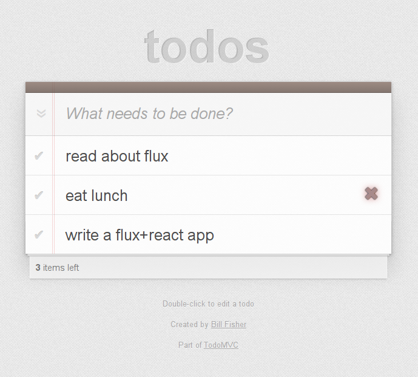

# Reactive-Flux TodoMVC Example
This is what a running Reactive Flux TodoMVC example with ReactJS & RxJS looks like:

## Overview

## Structure and Data Flow

### Views

### Actions

### Stores

Stores contain the application state and logic. Their role is somewhat similar to a model in a traditional MVC, but they manage the state of many objects — they are not instances of one object. Nor are they the same as Backbone's collections. More than simply managing a collection of ORM-style objects, stores manage the application state for a particular __domain__ within the application.

For example, Facebook's [Lookback Video Editor](https://facebook.com/lookback/edit) utilized a TimeStore that kept track of the playback time position and the playback state. On the other hand, the same application's ImageStore kept track of a collection of images.  The TodoStore in our TodoMVC example is similar in that it manages a collection of to-do items.  A store exhibits characteristics of both a collection of models and a singleton model of a logical domain.

As mentioned above, a store registers itself with the dispatcher and provides it with a callback. This callback receives a data payload as a parameter. The payload contains an action with an attribute identifying the action's type. Within the store's registered callback, a switch statement based on the action's type is used to interpret the payload and to provide the proper hooks into the store's internal methods. This allows an action to result in an update to the state of the store, via the dispatcher. After the stores are updated, they broadcast an event declaring that their state has changed, so the views may query the new state and update themselves.

## TodoMVC Example Implementation

In this TodoMVC example application, we can see the elements of Flux in our directory structure. Views here are referred to as "components" as they are React components.

<pre>
./
  index.html
  js/
    actions/
      TodoActions.js
    app.js
    bundle.js
    dispatcher/
      AppDispatcher.js
    components/
      Footer.react.js
      Header.react.js
      MainSection.react.js
      TodoApp.react.js
      TodoItem.react.js
      TodoTextInput.react.js
    stores/
      TodoStore.js
</pre>

The primary entry point into the application is app.js.  This file bootstraps the React rendering inside of index.html.  TodoApp.react.js is our controller-view and it passes all data down into its child React components.

TodoActions.js is a collection of action creator methods that views may call from within their event handlers, in response to user interactions.  They are nothing more than helpers that call into the AppDispatcher.

Dispatcher.js is a base class for AppDispatcher.js which extends it with a small amount of application-specific code.

TodoStore.js is our only store.  It provides all of the application logic and in-memory storage.  Based on EventEmitter from Node.js, it emits "change" events after responding to actions in the callback it registers with the dispatcher.

The bundle.js file is automatically genenerated by the build process, explained below.

## Running

You must have [npm](https://www.npmjs.org/) installed on your computer.
From the root project directory run these commands from the command line:

    npm install

This will install all dependencies.

To build the project, first run this command:

    npm start

This will perform an initial build and start a watcher process that will update bundle.js with any changes you wish to make.  This watcher is based on [Browserify](http://browserify.org/) and [Watchify](https://github.com/substack/watchify), and it transforms React's JSX syntax into standard JavaScript with [Reactify](https://github.com/andreypopp/reactify).

To run the app, spin up an HTTP server and visit http://localhost/.../todomvc-flux/.  Or simply open the index.html file in a browser.

## Credit

This TodoMVC application was forked form the [flux example application](https://github.com/facebook/flux/tree/master/examples/flux-todomvc) and re-created by [Mike Nimer](https://www.twitter.com/mnimer).

